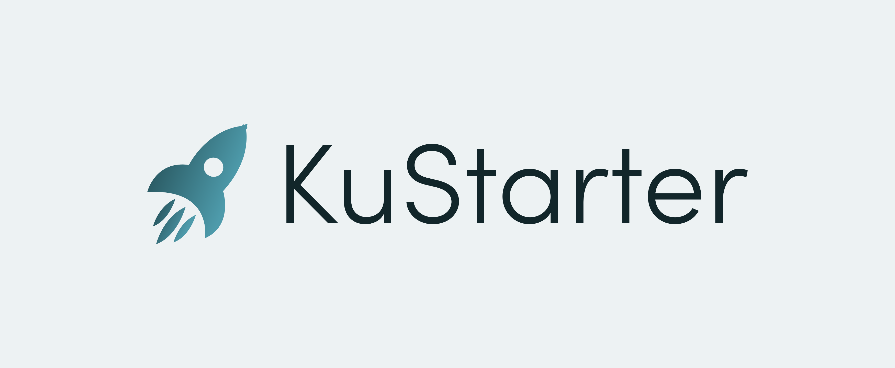

# KuStarter $KUST 🚀
  

A new and innovative launchpad for projects on the [KuCoin Community Chain](kcc.io).

## Prerequisites

NodeJS & Yarn.  

If you use [nvm](https://github.com/nvm-sh/nvm) (which you should), first run `nvm use`, then `npm install -g yarn`.  

Copy `.env.example` to `.env` and fill it as required.

### Run Tests

```
yarn install
yarn test
```

### Deploy Contracts

```
TBC
```

#### Deployed Addresses

| Contract | Contract address |
|----------|------------------|
| Presale          | TBC |
| TokenVesting     | TBC |
| KUST Token       | TBC |
| LaunchPad        | TBC | 


### Directory Structure

    .
    ├── .vscode                 # Project setup to work with VS Code nicely
    ├── contracts               # Contracts for KuStarter
    │   └── test                # Contracts only used for tests, never deployed to production
    ├── scripts                 # Hardhat scripts (e.g. deployments)
    ├── test                    # Automated tests
    ├── .env.example            # env vars
    ├── .nvmrc                  # used by nvm to easily use required node version
    ├── hardhat.config.js       # Hardhat config with KCC networks setup
    ├── LICENSE
    ├── package.json            # The usual for Yarn
    └── README.md

