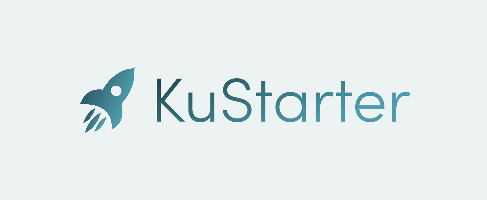

# KuStarter $KUST 🚀
[](http://kustarter.com)
  

A new and innovative launchpad for projects on the [KuCoin Community Chain](kcc.io).

## Prerequisites

NodeJS & Yarn.  

If you use [nvm](https://github.com/nvm-sh/nvm) (which you should), first run `nvm use`, then `npm install -g yarn`.  

Copy `.env.example` to `.env` and fill it as required.

### Run Tests

```
yarn install
yarn run test
```

### Deploy Contracts

```
yarn run deploy
```

#### Deployed Addresses

| Contract                   | Contract address |
|----------------------------|------------------|
| DAOFundTimelock            | [0xE7c23814688588f24fc6C2EfB3035ac3f063f428](https://explorer.kcc.io/en/address/0xE7c23814688588f24fc6C2EfB3035ac3f063f428) |
| StakingRewardsTimelock     | [0x1cEc6dF31A92518c9158cF34Ea3165bC833F9aef](https://explorer.kcc.io/en/address/0x1cEc6dF31A92518c9158cF34Ea3165bC833F9aef) |
| LPMiningRewardsTimelock    | [0xe5E8a5b16995e863A388B85179a97aaB555eeEB8](https://explorer.kcc.io/en/address/0xe5E8a5b16995e863A388B85179a97aaB555eeEB8) |
| Presale                    | [0xaf38a208A4A69D01830f28e4D20cBfd4CB348874](https://explorer.kcc.io/en/address/0xaf38a208A4A69D01830f28e4D20cBfd4CB348874) |
| KuStarterToken             | [0xfC56A7E70F6c970538020cc39939929b4d393F1F](https://explorer.kcc.io/en/address/0xfC56A7E70F6c970538020cc39939929b4d393F1F) |
| SaleVesting                | [0x3284B8D9de9E086666E18774436563803A8eB092](https://explorer.kcc.io/en/address/0x3284B8D9de9E086666E18774436563803A8eB092) |
| MarketingVesting           | [0xA9Dd371e282BE572426bDca50F16854Fe41b2983](https://explorer.kcc.io/en/address/0xA9Dd371e282BE572426bDca50F16854Fe41b2983) |
| DevelopmentVesting1        | [0x6549B81Fd6ed83Bb12f072EC4ddBA1233f0d143b](https://explorer.kcc.io/en/address/0x6549B81Fd6ed83Bb12f072EC4ddBA1233f0d143b) |
| DevelopmentVesting2        | [0x3285b13Da0FEf2Df24bB46c0Dc25Ce92e453e226](https://explorer.kcc.io/en/address/0x3285b13Da0FEf2Df24bB46c0Dc25Ce92e453e226) |

**Important Transactions**:
 - Tx for deploying DAOFundTimelock with lock of 7 days mined with hash https://explorer.kcc.io/en/tx/0x0be529322c43c61f12f9d6517a6252e7db05351a9583fc08242a11e037f01678
 - Tx for deploying StakingRewardsTimelock with lock of 4 days mined with hash https://explorer.kcc.io/en/tx/0xc6bf73dfea3b580c22339a822fa8e6a98714d0c3251ecac9727d0704ebc78187
 - Tx for deploying LPMiningRewardsTimelock with lock of 4 days mined with hash https://explorer.kcc.io/en/tx/0xb611814f89aab38862ab6646687c089894caa258e3486d42453b5ca8ad30fee5
 - Tx for deploying KuStarter Token mined with hash https://explorer.kcc.io/en/tx/0x0c727527aabd2feae808b86c7e19b9d482a54bb05d20af7e3e9df1d300dbb8f4
 - Tx for adding tokens to Sale Vesting contract mined with hash https://explorer.kcc.io/en/tx/0xed505c434a6a4a527243a13c44166c0b4b23fc63198ac2bab9b00823199e0f88
 - Tx for adding tokens to Marketing Vesting contract mined with hash https://explorer.kcc.io/en/tx/0xe26b72eb4966d57897dfcb87e5bd83484177473a8b4cd8e662d275b5ffd0714e
 - Tx for adding tokens to Development Vesting 1 contract mined with hash https://explorer.kcc.io/en/tx/0x159edec3ffa29aaf6e8a15ae91916a3053fc1e6d979fcd790d95155534d3924a
 - Tx for adding tokens to Development Vesting 2 contract mined with hash https://explorer.kcc.io/en/tx/0xaa093751afe47fdd740c8617559f2cf06b1d776e60d01939983eb6e3b00c00fe
 - Tx for initializing Presale contract mined with hash https://explorer.kcc.io/en/tx/0x8c9f27b2761ccdd279e28b5d011eba26355e3f8407170283e2f2f43bb663c16d

### Directory Structure

    .
    ├── .vscode                 # Project setup to work with VS Code nicely
    ├── contracts               # Contracts for KuStarter
    │   └── test                # Contracts only used for tests, never deployed to production
    ├── scripts                 # Hardhat scripts (e.g. deployments)
    ├── test                    # Automated tests
    ├── utls                    # Miscellaneous utility files
    ├── .env.example            # env vars
    ├── .nvmrc                  # used by nvm to easily use required node version
    ├── hardhat.config.js       # Hardhat config with KCC networks setup
    ├── LICENSE
    ├── package.json            # The usual for Yarn
    └── README.md

#### Koffeeswap Resources

`utils/KoffeeSwapRouter.abi.json` taken from https://github.com/KoffeeSwap/koffeeswap-contracts as there is no NPM package
